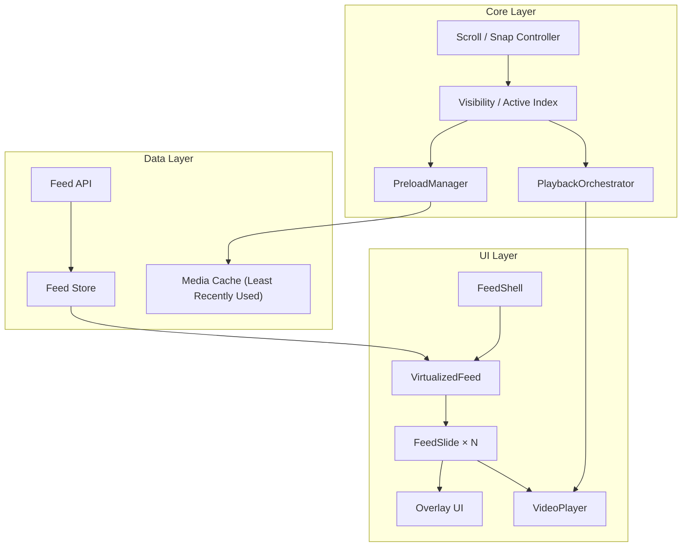
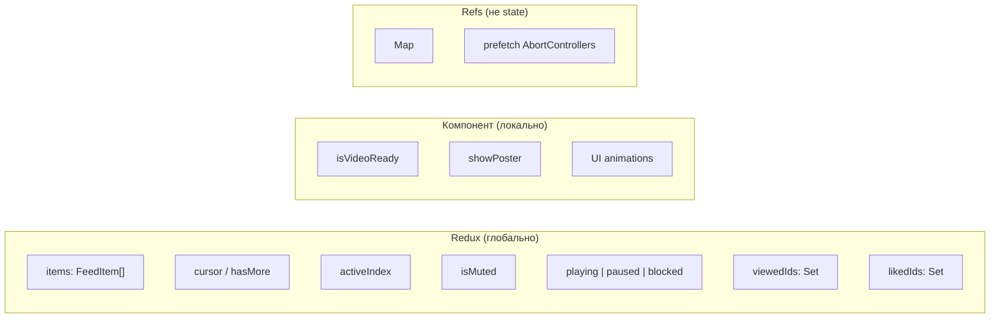

# Лента медиа-контента.

Mobile-first веб-страница с вертикальной лентой коротких видео (аналог TikTok / Instagram Reels / YouTube Shorts): пользователь скроллит ленту, активное видео воспроизводится автоматически, следующие элементы подгружаются заранее.

Документ показывает, что реализовано в рабочем прототипе, и дополняет это планом развития для production: архитектурой, обоснованием решений и следующими техническими шагами.

---

## Содержание

1. [Статус прототипа](#статус-прототипа)
2. [Цели и критерии успеха](#цели-и-критерии-успеха)
3. [Целевая production-архитектура](#целевая-production-архитектура)
4. [Стек, работа с видео и реализация в прототипе](#1-стек-работа-с-видео-и-реализация-в-прототипе)
5. [Механизм скролла и жестов](#2-механизм-скролла-между-элементами-ленты)
6. [Стратегия предзагрузки](#3-стратегия-предзагрузки-контента)
7. [Управление состоянием](#4-управление-состоянием)
8. [Производительность](#5-производительность)
9. [Что можно улучшить по сравнению с TikTok, Reels и Shorts](#6-что-можно-улучшить-по-сравнению-с-tiktok-reels-и-shorts)
10. [Прогресс реализации](#прогресс-реализации)
11. [Что можно улучшить при большем времени](#что-можно-улучшить-при-большем-времени)

---

## Статус прототипа

Прототип использует реальные MP4-ролики из Cloudflare R2 и нативный `<video>`.

| Область | Статус | Что можно проверить |
|---------|--------|---------------------|
| Видео | ✅ Готово | Autoplay muted, tap play/pause, sound toggle, resume с прошлой позиции |
| Лента | ✅ Готово | Fullscreen CSS Scroll Snap и активный слайд в Redux |
| Предзагрузка | 🟡 MVP | Active — `auto`, следующий ролик — `metadata`, остальные — `none` |
| State | ✅ Готово | Redux для active slide, mute и likes |
| Ошибки и фон | ✅ Готово | Loading, Retry, pause/resume через Page Visibility API |
| Длинная лента | 📋 План | Виртуализация, pagination и отдельный PreloadManager |

### Как запустить

```bash
Удалённо: 
https://video-feed-test.vercel.app

Локально:
npm install
npm run dev
```

### Доставка медиа

Видео доставляются из Cloudflare R2 через `https://media.namazon.club`. Это позволяет держать Git-репозиторий и Vercel deployment лёгкими, но использовать реальные MP4 в демо.

---

## Цели и критерии успеха

**Цель:** одна «карточка» видео на весь экран, плавный вертикальный скролл со snap, автоплей активного ролика, предзагрузка следующих элементов без перегрузки сети и устройства.

**Критерии успеха:**

| Метрика | Целевое значение |
|---------|------------------|
| Time to first frame (активный ролик) | ≤ 300–500 ms на 4G |
| Переключение между роликами | без чёрного экрана, poster → video crossfade |
| Быстрый скролл с инерцией | без зависаний, без гонок play/pause |
| Память | не растёт линейно с длиной ленты |
| Autoplay | стабильный muted autoplay на iOS/Android/desktop |

**Вне scope MVP:** авторизация, комментарии, рекомендательный алгоритм, загрузка видео пользователями, продакшн-аналитика.

---

## Целевая production-архитектура

Диаграмма ниже описывает целевую архитектуру для длинной production-ленты. Текущий MVP реализует упрощённый вариант: CSS Scroll Snap, Redux, native `<video>` и preload active/+1.



В MVP логика `play()` / `pause()` находится в `VideoPlayer`; отдельного `PlaybackOrchestrator` пока нет. Он указан в схеме как часть целевой production-архитектуры для координации нескольких видео в длинной ленте.

**Ключевой принцип:** один `PlaybackOrchestrator` решает, *какое* видео играет. UI только отображает состояние. Это убирает гонки при быстром скролле, когда несколько компонентов одновременно вызывают `play()` / `pause()`.

**Поток данных при смене слайда:**

```
scroll / snap → IntersectionObserver → activeIndex
    → PlaybackOrchestrator.setActive(id)
    → pause all except active
    → play active (muted)
    → PreloadManager.schedule(+1, +2)
    → dispatch(markViewed(id)) (после порога просмотра)
```

---

## 1. Стек, работа с видео и реализация в прототипе.

### Что есть в прототипе

- React + TypeScript + Vite + CSS Modules + Redux Toolkit;
- native `<video>` с MP4 из Cloudflare R2;
- `muted`, `loop`, `playsInline` и глобальный переключатель звука;
- CSS Scroll Snap и определение активного слайда через `scrollend`;
- при переходе на другой слайд прошлое видео ставится на паузу, а активное запускается;
- видео остаются в DOM, поэтому при возврате воспроизведение продолжается с прошлой секунды;
- при сворачивании вкладки активное видео ставится на паузу; при возврате продолжится, только если до этого играло;
- tap play/pause, progress bar, loading, Retry и likes;
- `preload`: active — `auto`, следующий ролик — `metadata`, остальные — `none`;
- `object-fit: cover` для заполнения вертикального экрана горизонтальным исходным видео.

### Что добавить в рабочем проекте

- несколько версий ролика: MP4/WebM и автоматический выбор качества под скорость интернета (HLS);
- preview-картинка до старта, отслеживание зависаний и переход на более низкое качество при плохой сети;
- повторная загрузка при ошибке с увеличением паузы между попытками и выбор стартового качества по состоянию сети.

### Выбор стека

| Слой | Решение | Обоснование |
|------|---------|-------------|
| Framework | React 19 + TypeScript | Типизация, предсказуемый жизненный цикл и развитая экосистема. |
| Bundler | Vite | Быстрый dev, простой деплой статики |
| Стили | CSS Modules | Изоляция стилей без лишнего веса |
| Виртуализация | `@tanstack/react-virtual` | Контроль над windowed render длинного списка |
| State | Redux Toolkit | Предсказуемый data flow, DevTools, RTK Query для pagination API |
| Плеер | Нативный `<video>` | Достаточно для short-form, меньше bundle чем Video.js |
| HLS (опционально) | hls.js | Только если API отдаёт adaptive streaming (.m3u8) |

**Почему нативный `<video>`, а не Video.js / Plyr:** для short-form нужны autoplay, mute, loop, poster и preload — это покрывает native API. Полноценный плеер оправдан при DRM, кастомных контролах, рекламных вставках — здесь это overkill.

### Форматы и источники

Приоритет источников на клиенте:

1. **WebM (VP9 / AV1)** — меньше трафика там, где поддерживается
2. **MP4 (H.264)** — fallback для Safari / iOS
3. **HLS** — если ролики длиннее или нужен adaptive bitrate

Ожидаемый контракт API:

```json
{
  "id": "abc123",
  "duration": 12.4,
  "posterUrl": "https://cdn.example.com/posters/abc123.jpg",
  "sources": [
    { "type": "video/webm", "url": "...", "bitrate": 800000 },
    { "type": "video/mp4", "url": "...", "bitrate": 1200000 }
  ],
  "width": 1080,
  "height": 1920
}
```

Выбор bitrate: по `navigator.connection.effectiveType` (если доступно) или medium по умолчанию.

### Политика воспроизведения

```typescript
interface PlaybackPolicy {
  autoplay: true;
  muted: true;        // обязательно для autoplay policy браузеров
  loop: true;
  playsInline: true;  // критично для iOS
  preload: 'none' | 'metadata' | 'auto'; // управляется PreloadManager
}
```

Браузеры разрешают autoplay только без звука. Звук включается явным действием пользователя (tap), выбор запоминается в session.

### Буферизация

| Роль слайда | preload | Действие |
|-------------|---------|----------|
| Активный | `auto` | Цель: `canplaythrough` или 2–3 сек буфера |
| Следующий (+1) | `metadata` + fetch | Prefetch первых MB через HTTP Range |
| Остальные | `none` | Только poster |

**Обработка ошибок:**

- timeout на `loadeddata` (3s) → poster + кнопка Retry (1–2 попытки с backoff);
- `stalled` / `waiting` > 1s → переключение на более низкий bitrate tier;
- autoplay blocked → overlay «Tap to play».

### Псевдокод PlaybackOrchestrator

```typescript
class PlaybackOrchestrator {
  private activeId: string | null = null;

  setActive(id: string) {
    if (this.activeId === id) return;

    for (const [videoId, el] of videoRefs) {
      if (videoId !== id) el.pause();
    }

    this.activeId = id;
    const video = videoRefs.get(id);
    if (!video) return;

    video.muted = store.getState().feed.isMuted;
    video.play().catch(() => store.dispatch(setPlaybackBlocked(true)));
  }

  onIntersection(entries: IntersectionObserverEntry[]) {
    const candidate = entries
      .filter(e => e.intersectionRatio >= 0.6)
      .sort((a, b) => b.intersectionRatio - a.intersectionRatio)[0];

    if (candidate) {
      this.setActive(candidate.target.dataset.videoId!);
    }
  }
}
```

---

## 2. Механизм скролла между элементами ленты

### Что есть в прототипе

- CSS Scroll Snap с `100dvh`;
- `scrollend` вычисляет `activeIndex` и сохраняет его в Redux;
- tap по активному ролику переключает play/pause.

### Что добавить в рабочем проекте

- IntersectionObserver как дополнительный источник active state;
- double tap like, long press pause и fallback для браузеров без стабильного `scrollend`;
- focus management для клавиатуры и screen readers.

### Подход: CSS Scroll Snap

```css
.feed {
  height: 100dvh;
  overflow-y: scroll;
  scroll-snap-type: y mandatory;
  overscroll-behavior-y: contain;
  -webkit-overflow-scrolling: touch;
}

.slide {
  height: 100dvh;
  scroll-snap-align: start;
  scroll-snap-stop: always;
}
```

**Почему scroll snap, а не Swiper.js:**

- нативная инерция и физика скролла;
- accessibility: клавиатура, scroll chaining;
- меньше JS на hot path;
- Swiper оправдан при 3D-эффектах и сложных transition — для TikTok-like ленты избыточен.

`100dvh` вместо `100vh` — dynamic viewport учитывает mobile browser chrome (адресная строка).

### Определение активного слайда

Слайд определяется с помощью двух механизмов:

1. **IntersectionObserver** — элемент с `intersectionRatio ≥ 0.6` становится кандидатом в active.
2. **`scrollend`** (или debounced scroll) — финальный index после остановки скролла.

При быстром скролле с инерцией IntersectionObserver может «дёргаться» между соседними слайдами — `scrollend` финализирует `activeIndex`:

```typescript
container.addEventListener('scrollend', () => {
  const index = Math.round(container.scrollTop / container.clientHeight);
  store.dispatch(setActiveIndex(index));
});
```

### Жесты

| Жест | Поведение |
|------|-----------|
| Vertical swipe / fling | Нативный scroll + snap |
| Tap | Pause / play или показать UI |
| Double tap | Like (опционально) |
| Long press | Pause (опционально) |

**Конфликт жестов:** overlay-кнопки с `pointer-events: auto`, на видео — tap handler без блокировки vertical scroll (`touch-action: pan-y`).

### Fallback для старых браузеров

Если `scroll-snap-stop: always` ведёт себя нестабильно — programmatic snap после жеста:

```typescript
container.scrollTo({
  top: index * container.clientHeight,
  behavior: 'smooth',
});
```

---

## 3. Стратегия предзагрузки контента

### Что есть в прототипе

```text
active → preload="auto"
next   → preload="metadata"
other  → preload="none"
```

Браузер сам использует HTTP Range requests к Cloudflare R2. Для пяти роликов этого достаточно без отдельного менеджера запросов.

### Что добавить в рабочем проекте

- окно +2 с poster/metadata;
- `PreloadManager`, `AbortController` и лимиты параллельных запросов;
- `Save-Data`, 2G и velocity-based prefetch.

### Окно рендера и сети

**DOM (виртуализация):** рендерим `activeIndex - 1` … `activeIndex + 2` → **4 слайда** в DOM.

**Сеть (медиа):**

| Расстояние от active | Действие |
|----------------------|----------|
| 0 (active) | Full preload + play |
| +1 | Prefetch video (первые 1–3 MB) |
| +2 | Poster + metadata в store |
| +3 и дальше | Только metadata (id, poster, duration) |
| −1 (назад) | Держать в memory cache, не prefetch заново |
| ≤ −2 | Unload `src`, оставить poster |

**Пагинация API:** запрос следующей страницы, когда `activeIndex >= items.length - 5`.

### Лимиты (не перегружать сеть и устройство)

```typescript
const PreloadLimits = {
  maxConcurrentVideoPrefetches: 2,
  maxCacheSizeMB: 80,
  maxBufferedVideosInMemory: 3,
  prefetchDebounceMs: 180,
};
```

**Адаптация под сеть:**

```typescript
function shouldPrefetch(): boolean {
  const conn = navigator.connection;
  if (!conn) return true;
  if (conn.saveData) return false;
  if (['slow-2g', '2g'].includes(conn.effectiveType)) return false;
  return true;
}
```

При `saveData` или 2G: только poster для +1, без prefetch +2, lowest bitrate tier.

### Отмена при быстром скролле

```typescript
let prefetchTimer: ReturnType<typeof setTimeout>;
let abortController: AbortController | null = null;

function schedulePrefetch(index: number) {
  clearTimeout(prefetchTimer);
  abortController?.abort();

  prefetchTimer = setTimeout(() => {
    if (Math.abs(index - store.getState().feed.activeIndex) > 2) return;

    abortController = new AbortController();
    preloadManager.prefetch(items[index + 1], abortController.signal);
  }, PreloadLimits.prefetchDebounceMs);
}
```

### Predictive prefetch (улучшение)

Если scroll velocity высокая (пользователь быстро листает) → prefetch до +2.
Если медленная или пользователь на ролике > 1s → только +1 (экономия трафика).

---

## 4. Управление состоянием

### Что есть в прототипе

- Redux: `items`, `activeIndex`, `isMuted`, `likedIds`;
- локально в `VideoPlayer`: loading, error, pause state и progress;
- `currentTime` хранится самим mounted video element, поэтому ролик продолжает воспроизведение с прошлой секунды.

### Что добавить в рабочем проекте

- `viewedIds`, cursor pagination и RTK Query;
- SessionStorage/IndexedDB cache;
- серверная синхронизация likes и истории просмотров.

### Разделение ответственности

Схема ниже показывает целевое разделение состояния в production-версии. В текущем MVP уже есть `items`, `activeIndex`, `isMuted`, `likedIds`, а также локальные состояния loading/error/pause/progress. `cursor`, `viewedIds`, `Map` video refs и AbortControllers добавляются, когда появятся pagination, виртуализация и управляемая предзагрузка.



### Что, где хранить 

**В Redux (slice `feed`):**

- список элементов ленты + pagination cursor;
- `activeIndex`, `isMuted`, глобальный playback state;
- user actions: liked, viewed;
- **не** хранить `currentTime` каждого видео — это вызывает 30+ re-render/sec.

**Локально в FeedSlide:**

- loading skeleton, buffering spinner;
- анимации (double-tap heart и т.п.).

**В refs (вне React state):**

- `Map<videoId, HTMLVideoElement>` — прямой доступ для orchestrator;
- abort controllers для prefetch.

### Как избежать лишних перерисовок с помощью селекторов

```typescript
// ✅ Подписка только на нужные данные (useAppSelector + memoized selectors)
const item = useAppSelector(state => selectFeedItem(state, index));
const isActive = useAppSelector(state => state.feed.activeIndex === index);

// ❌ Подписка на весь slice без селектора
const feed = useAppSelector(state => state.feed);
```

Pagination через **RTK Query** (`feedApi.endpoints.getFeedPage`) — кэш страниц, защита от одновременных повторных запросов, invalidation при необходимости.

### Кэш просмотренного

| Уровень | Что храним | Зачем |
|---------|-----------|-------|
| In-memory LRU | URLs последних N видео | Быстрый возврат назад |
| SessionStorage | `viewedIds`, `lastActiveIndex` | Восстановление после refresh |
| HTTP cache браузера | MP4/WebM сегменты | Нативное кэширование без дублирования blob |
| IndexedDB (опционально) | Poster thumbnails | Offline-first, если потребуется |

```typescript
// store/feedSlice.ts
interface FeedState {
  items: FeedItem[];
  activeIndex: number;
  isMuted: boolean;
  playbackBlocked: boolean;
  viewedIds: string[];
  likedIds: string[];
}

const feedSlice = createSlice({
  name: 'feed',
  initialState,
  reducers: {
    appendPage(state, action: PayloadAction<FeedItem[]>) {
      state.items.push(...action.payload);
    },
    setActiveIndex(state, action: PayloadAction<number>) {
      state.activeIndex = action.payload;
    },
    setPlaybackBlocked(state, action: PayloadAction<boolean>) {
      state.playbackBlocked = action.payload;
    },
    markViewed(state, action: PayloadAction<string>) {
      if (!state.viewedIds.includes(action.payload)) {
        state.viewedIds.push(action.payload);
      }
    },
  },
});
```

---

## 5. Производительность

### Что есть в прототипе

- одновременно играет только active video;
- Page Visibility API ставит ролик на паузу в неактивной  вкладке и продолжает воспроизведение при возврате;
- preload ограничен активным и следующим роликом.

### Что добавить в рабочем проекте

- `@tanstack/react-virtual` для длинного списка;
- cleanup старых `<video>` и ограничение числа decoder instances;
- `React.memo`, requestAnimationFrame для progress bar и задержка обработки при быстром скролле.

### Виртуализация длинного списка

1000 `<video>` в DOM перегружают память, видеодекодеры и отрисовку.

**Подход:** windowed render через `@tanstack/react-virtual`:

```typescript
const virtualizer = useVirtualizer({
  count: items.length,
  getScrollElement: () => containerRef.current,
  estimateSize: () => window.innerHeight,
  overscan: 1,
});
```

При unmount слайда — обязательная очистка:

```typescript
function unloadVideo(video: HTMLVideoElement) {
  video.pause();
  video.removeAttribute('src');
  video.load(); // освобождает декодер
}
```

### Борьба с лишними re-render

- `React.memo(FeedSlide)` со сравнением по `item.id`, `isActive`, `isMuted`;
- progress bar обновлять через `requestAnimationFrame` + ref, не `setState`;
- PlaybackOrchestrator — один общий объект для всей ленты, а не отдельный объект внутри каждой карточки.
- избегать inline objects/functions в props слайдов.

### Поведение при быстром скролле

| Проблема | Решение |
|----------|---------|
| Много play()/pause() | Единый orchestrator + debounce 50ms |
| Чёрный кадр | Poster visible до `loadeddata`, crossfade opacity |
| Scroll jank | `will-change: transform` на overlay, не на `<video>` |
| Prefetch waste | Debounce + AbortController |
| Memory spike | Hard limit: max 3 video elements с src |

### Page Visibility

При `document.hidden` — pause active video, при возврате — resume только если slide всё ещё active. Экономит батарею и CPU.

### Метрики (для прототипа)

- **Web Vitals:** INP, LCP (poster as LCP element)
- **Custom:** `time_to_first_frame`, `time_to_switch`, `prefetch_hit_rate`
- **Quality:** `video.getVideoPlaybackQuality()?.droppedVideoFrames`

---

## 6. Что можно улучшить по сравнению с TikTok, Reels и Shorts

### Что есть в прототипе

- явная кнопка звука вместо непонятного muted autoplay;
- pause в фоновой вкладке;
- Retry вместо чёрного экрана;
- resume с последней позиции.

### Что добавить в рабочем проекте

- Data Saver / Wi-Fi-only preload;
- captions, focus management и progressive UI hiding;
- predictive prefetch и offline cache.

Осознанные улучшения по сравнению с типичным UX TikTok / Reels / Shorts:

| Что улучшаем | Типичная проблема | Как решаем |
|--------------|------------------|------------|
| Звук при автозапуске | Неясно, почему ролик без звука | Показываем заметную кнопку включения звука и запоминаем выбор |
| Экономия трафика | Лента заранее загружает слишком много видео | Учитываем режим экономии трафика и разрешаем предзагрузку только по Wi‑Fi |
| Доступность | Лентой сложно пользоваться со screen reader | Добавляем понятные подписи, субтитры и управление с клавиатуры |
| Возврат к прошлому ролику | Видео приходится загружать заново | Держим предыдущий ролик в памяти и продолжаем с прошлого места |
| Расход батареи | Видео продолжает работать в фоне | Ставим ролик на паузу, когда вкладка неактивна |
| Перегруженный интерфейс | На экране слишком много кнопок | Скрываем элементы управления через пару секунд, показываем их по tap |
| Ошибки сети | Вместо видео появляется чёрный экран | Показываем preview, кнопку повтора и при необходимости снижаем качество |
| Быстрый скролл | Предзагрузка работает одинаково всегда | При быстром скролле готовим два следующих ролика, при медленном — один |

---

## Прогресс реализации

- [x] Fullscreen-лента с CSS Scroll Snap
- [x] Отслеживание активного слайда через Redux
- [x] Нативное MP4-воспроизведение через Cloudflare R2
- [x] Autoplay, pause/resume, переключатель звука и progress bar
- [x] MVP-предзагрузка и Page Visibility API
- [x] Loading, Retry и likes в Redux
- [ ] Виртуализация длинной ленты
- [ ] Cursor pagination и интеграция с API
- [ ] PreloadManager с отменой запросов и учётом сети
- [ ] HLS / адаптивный bitrate
- [ ] Метрики, E2E-тесты и deployment

### Структура прототипа и план развития

Обычные строки уже есть в проекте. Строки с `+` — планируется в production, они выделены зелёным.

```diff
src/
  App.tsx                  # корневой компонент
  index.css                # глобальные стили
  main.tsx                 # React root и Redux Provider
  api/
    mockFeed.ts            # локальные данные и URL видео из R2
+   feedApi.ts              # cursor pagination и запросы к API
  components/
    FeedShell.tsx          # scroll snap и active slide
    FeedShell.module.css
    FeedSlide.tsx          # карточка ролика и overlay
    FeedSlide.module.css
    VideoPlayer.tsx        # native playback, preload и Page Visibility
    VideoPlayer.module.css
+   VirtualizedFeed.tsx    # tanstack virtual для длинной ленты
+ core/
+   PlaybackOrchestrator.ts
+   PreloadManager.ts
+   IntersectionController.ts
  store/
    index.ts               # configureStore
    feedSlice.ts           # active slide, mute и likes
+   feedApi.ts             # RTK Query endpoints
+   selectors.ts           # memoized selectors
  hooks/
    redux.ts               # typed Redux hooks
+   useActiveSlide.ts
+   usePageVisibility.ts
  types/
    feed.ts                # FeedItem contract
```

---

## Что можно улучшить при большем времени

- **hls.js + adaptive bitrate** — если контент > 60 сек или нестабильная сеть
- **Service Worker** — offline cache для poster + metadata
- **Web Worker** — расчёт очереди предзагрузки в отдельном потоке, чтобы не нагружать интерфейс.
- **SSR первого ролика** — заголовок, описание и preview-картинка для ссылки в соцсетях и мессенджерах.
- **E2E тесты** — проверка в браузере: скролл, запуск активного ролика и предзагрузка следующего.

